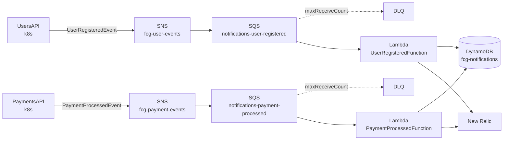

# SDD — NotificationsAPI → Função Serverless

**Software Design Document · FIAP Cloud Games · Tech Challenge Fase 3**

| | |
|---|---|
| **Repositório** | `FIAPCloudGames-fase3-NotificationsServerless` |
| **Origem** | clone de `FIAPCloudGames-fase2-NotificationsAPI` (histórico preservado, `origin` removido) |
| **Rota de mensageria** | **B — Amazon SNS + SQS** |
| **Observabilidade** | **New Relic** (Opção B do enunciado) |
| **Status** | Design aprovado, implementação não iniciada |
| **Última atualização** | 2026-08-24 |

---

## 1. Contexto e motivação

O `NotificationsAPI` da Fase 2 é um container ASP.NET Core rodando 24/7 no Kubernetes com duas
responsabilidades acopladas no mesmo processo:

1. **Consumers RabbitMQ** — dois `BackgroundService` registrados por `AddRabbitMqConsumer`, que
   consomem `UserRegisteredEvent` e `PaymentProcessedEvent` e disparam o "envio" de e-mail
   (simulado via logging estruturado).
2. **API HTTP CRUD** — sete endpoints em `/notifications` sobre EF Core + PostgreSQL.

O enunciado da Fase 3 identifica o problema diretamente: *"o serviço de notificações passa a maior
parte do tempo ocioso, aguardando eventos. Manter um container rodando 24/7 para uma tarefa tão
esporádica está se provando um desperdício de recursos computacionais."*

O requisito é refatorar o serviço para uma função acionada **diretamente por mensagens da fila**,
substituindo o container contínuo, com código e IaC em repositório próprio.

## 2. Escopo

### Dentro do escopo

- Função Lambda acionada por SQS, substituindo os dois consumers.
- Migração da persistência de PostgreSQL para **DynamoDB** (atende também o requisito NoSQL).
- Infraestrutura como código (AWS SAM) versionada neste repositório.
- Instrumentação New Relic da função (métricas, logs e traces).
- Pipeline de deploy no GitHub Actions.

### Fora do escopo

- **A API HTTP CRUD é descartada** — ver [DD-02](#dd-02--descartar-a-api-http).
- API Gateway, cache Redis e instrumentação dos demais microsserviços: são requisitos da Fase 3,
  mas pertencem aos repositórios `UsersAPI`, `CatalogAPI`, `PaymentsAPI` e `Orchestration`.
- Envio real de e-mail — permanece simulado via logging, como na Fase 2.

## 3. Rastreabilidade de requisitos

| # | Requisito (enunciado Fase 3) | Onde é atendido |
|---|---|---|
| 2 | Refatorar NotificationsAPI para função serverless | Todo este documento |
| 2 | Acionada diretamente por mensagens da fila/tópico | [§5](#5-arquitetura-alvo), [DD-01](#dd-01--sns--sqs-em-vez-de-amazon-mq) |
| 2 | Código + IaC em repositório próprio | Este repo; [§10](#10-estrutura-do-repositório) |
| 3 | APM gerenciado instrumentando a função | [§9](#9-observabilidade-com-new-relic) |
| 3 | Métricas, logs e traces (3 pilares) | [§9](#9-observabilidade-com-new-relic) |
| 4 | NoSQL obrigatório (MongoDB ou DynamoDB) | [DD-03](#dd-03--dynamodb-substitui-postgresql), [§6](#6-modelo-de-dados-dynamodb) |

O requisito de cache Redis (item 4) **não é atendido aqui** — a função não tem carga de leitura que
justifique cache. Ele deve ser cumprido na `CatalogAPI`, onde há consultas repetidas de catálogo.

## 4. Estado atual (o que existe hoje)

```
NotificationsAPI/src/
├── Notifications.Domain/          Notification (aggregate), enums, exceptions, INotificationRepository
├── Notifications.Application/     UserRegisteredEventHandler, PaymentProcessedEventHandler, IEventDispatcher
├── Notifications.Infrastructure/  EF Core + Npgsql, EmailService, *MessageProcessor (RabbitMQ)
└── Notifications.API/             Program.cs, endpoints HTTP, middleware
```

O ponto favorável: **Domain e Application não conhecem RabbitMQ nem PostgreSQL**. Os handlers
dependem apenas de `INotificationRepository`, `IUnitOfWork`, `IEmailService` e `ILogger`. A migração
toca quase exclusivamente a camada de composição.

| Componente atual | Destino |
|---|---|
| `Notifications.Domain` | inalterado |
| `Notifications.Application` (handlers) | inalterado |
| `EmailService` | inalterado |
| `AddRabbitMqConsumer<T>` + `RabbitMqConsumerDefinition` | removido → event source mapping SQS no SAM |
| `UserRegisteredEventMessageProcessor` | vira handler Lambda |
| `PaymentProcessedEventMessageProcessor` | vira handler Lambda |
| `NotificationRepository` (EF Core) | `DynamoDbNotificationRepository` — mesma interface |
| `AppDbContext`, `UnitOfWork`, `Migrations/` | removidos |
| `Program.cs`, `Endpoints/`, `Middleware/`, `Models/` | removidos |
| `k8s/` | removido (a orquestração da função é o `template.yaml`) |

## 5. Arquitetura alvo



Fluxo de uma invocação:

1. SNS entrega a mensagem na fila SQS com **raw message delivery** habilitado — o corpo da mensagem
   SQS é o JSON puro do evento, idêntico ao que o `JsonSerializer.Deserialize<T>` já consome hoje.
2. O event source mapping do Lambda faz long polling e invoca a função com um lote de até 10 registros.
3. O handler desserializa cada registro, resolve um `IServiceScope` e delega ao `IEventDispatcher` —
   o mesmo dispatcher e os mesmos handlers de aplicação da Fase 2.
4. O handler persiste a `Notification` no DynamoDB e chama `IEmailService`, que registra o log estruturado.
5. Falhas parciais são devolvidas via `SQSBatchResponse` para reprocessamento seletivo.

## 6. Modelo de dados (DynamoDB)

Tabela única `fcg-notifications`, billing mode `PAY_PER_REQUEST`.

| Atributo | Tipo | Papel |
|---|---|---|
| `PK` | S | `NOTIFICATION#{Id}` — partition key |
| `Id` | S | Guid da notificação |
| `UserId` | S | Guid do usuário |
| `Type` | S | `WelcomeEmail` \| `PurchaseConfirmation` |
| `Status` | S | `Pending` \| `Sent` \| `Failed` \| `Delivered` |
| `RecipientEmail` | S | |
| `RecipientName` | S | opcional |
| `EventId` | S | Guid do evento de origem — chave de idempotência |
| `RetryCount` | N | |
| `LastError` | S | opcional |
| `CreatedAt` | S | ISO-8601 UTC |
| `UpdatedAt` | S | ISO-8601 UTC, opcional |

### Índices secundários

| GSI | PK | SK | Por quê |
|---|---|---|---|
| `GSI1-UserId` | `UserId` | `CreatedAt` | **Obrigatório.** `PaymentProcessedEventHandler` chama `GetByUserIdAsync` para recuperar o e-mail do usuário de uma notificação anterior (`PaymentProcessedEvent` não carrega o e-mail). |
| `GSI2-EventId` | `EventId` | — | Suporta `GetByEventIdAsync`. Opcional se a idempotência usar apenas conditional write ([DD-04](#dd-04--idempotência-por-conditional-write)). |

`GetAllAsync` e `GetByStatusAsync` da interface só eram usados pelos endpoints HTTP descartados.
Serão implementados como `Scan` e marcados como não recomendados para produção, ou removidos da
interface — decisão de implementação, ver [Q-03](#12-questões-em-aberto).

## 7. Decisões de design

### DD-01 — SNS + SQS em vez de Amazon MQ

**Contexto.** O Lambda não consegue ser acionado por RabbitMQ self-hosted; como event source só
aceita Amazon MQ. A alternativa era provisionar um broker Amazon MQ gerenciado e apenas repontar a
configuração (`RabbitMq__Host`) dos serviços existentes.

**Decisão.** Migrar para SNS + SQS.

**Justificativa.** Amazon MQ é um broker ligado 24/7 — manter um componente ocioso permanente
contradiz frontalmente a motivação declarada do desafio ("desperdício de recursos computacionais").
SNS/SQS é pay-per-request, traz DLQ, retry com backoff e batch failure reporting nativos, e é o
desenho serverless idiomático.

**Consequência.** Exige alterar os publishers em `UsersAPI` e `PaymentsAPI` e, provavelmente, uma
versão nova do pacote `FiapCloudGames.Contracts`. Ver [§11](#11-impacto-nos-outros-repositórios).
É trabalho coordenado com o grupo — o principal custo desta decisão.

### DD-02 — Descartar a API HTTP

**Decisão.** Os sete endpoints de `/notifications` e o `/health` não são portados.

**Justificativa.** O enunciado pede uma função *"acionada diretamente por novas mensagens na
fila/tópico"*, substituindo o container. Nenhum outro serviço da FCG consome esses endpoints — eram
utilitários de inspeção. Manter uma fachada HTTP na Lambda adicionaria API Gateway, cold start no
caminho síncrono e superfície de autenticação, sem requisito que o justifique.

**Consequência.** Inspeção de notificações passa a ser feita via console do DynamoDB e via New Relic.
Se o grupo quiser demonstrar leitura no vídeo, isso é reversível a baixo custo (uma Function URL).

### DD-03 — DynamoDB substitui PostgreSQL

**Decisão.** A persistência da função é DynamoDB. O PostgreSQL sai do serviço de notificações.

**Justificativa.** Três problemas resolvidos de uma vez:

1. **Requisito NoSQL** da Fase 3 é atendido pelo componente que já é naturalmente adequado — o
   enunciado cita "logs de eventos" como caso de uso, e notificação é exatamente isso: escrita
   append-only, leitura por chave, schema que tende a variar por tipo.
2. **Esgotamento de conexões.** Cada execution environment do Lambda abriria seu próprio pool Npgsql;
   sob concorrência isso derruba o RDS e obrigaria a introduzir RDS Proxy. DynamoDB é HTTP, sem pool.
3. **Migrations no cold start.** `Program.cs` chama hoje `await app.Services.MigrateAsync()` no startup.
   Em Lambda isso rodaria a cada cold start, em paralelo, com execuções concorrentes disputando o lock
   de migração. Com DynamoDB a tabela é criada pelo `template.yaml` e o problema deixa de existir.

**Consequência.** Perde-se transação multi-item e queries ad-hoc. Nenhuma das duas é usada pelos
handlers atuais.

### DD-04 — Idempotência por conditional write

**Contexto.** Hoje a idempotência é a constraint `UNIQUE` no `EventId` do PostgreSQL, capturada em
`UserRegisteredEventMessageProcessor.cs:69` como `PostgresException { SqlState: UniqueViolation }`.
Isso importa porque tanto SQS standard quanto o broker atual entregam *at-least-once*.

**Decisão.** Substituir por conditional write no DynamoDB:
`ConditionExpression: attribute_not_exists(EventId)`, tratando `ConditionalCheckFailedException`
no mesmo ponto onde hoje se trata `UniqueViolation`.

**Consequência.** O `DynamoDbNotificationRepository` traduz a exceção da AWS para a
`DuplicateEventException` de domínio, e a camada de mensageria deixa de depender do Npgsql —
uma dependência de infraestrutura que hoje vaza para o processador de mensagens.

### DD-05 — `IUnitOfWork` vira no-op

**Contexto.** Os handlers seguem `AddAsync(...)` seguido de `CommitAsync(...)`. DynamoDB não tem
unidade de trabalho equivalente.

**Decisão.** `AddAsync` escreve imediatamente (com o conditional write do DD-04) e `CommitAsync`
retorna `Task.FromResult(1)` sem efeito.

**Justificativa.** Preserva a interface e mantém `Notifications.Application` literalmente inalterado.
A alternativa — remover `IUnitOfWork` do domínio — daria um design mais honesto, mas propaga
alterações por handlers e testes sem ganho funcional nesta fase.

**Consequência.** Um `IUnitOfWork` que não faz nada é uma abstração enganosa. Deve ser documentado
com XML doc explícito na implementação. Registrado como dívida técnica.

### DD-06 — Uma função por tipo de evento

**Decisão.** Duas Lambdas: `UserRegisteredFunction` e `PaymentProcessedFunction`, no mesmo artefato,
com handlers distintos.

**Justificativa.** Concorrência, timeout, memória, DLQ e métricas independentes por evento. Um pico
de pagamentos não afeta o processamento de cadastros. É também mais legível no dashboard do New Relic.

### DD-07 — Batch com falha parcial

**Decisão.** Habilitar `FunctionResponseTypes: [ReportBatchItemFailures]` e retornar
`SQSBatchResponse` com os `itemIdentifier` que falharam.

**Justificativa.** Sem isso, uma única mensagem com falha reprocessa o lote inteiro, incluindo as
mensagens já processadas com sucesso — multiplicando invocações e dependendo inteiramente da
idempotência para não duplicar efeitos.

**Mapeamento do resultado atual:**

| `MessageProcessingResult` (Fase 2) | Comportamento na Lambda |
|---|---|
| `Success` | não entra no `SQSBatchResponse` — SQS remove a mensagem |
| `PoisonMessage` (JSON malformado, evento duplicado) | **não** reportar como falha; loga em WARN e descarta |
| `TransientFailure` | reportar `itemIdentifier` → SQS reentrega, DLQ após `maxReceiveCount` |

### DD-08 — Empacotamento e runtime

**Decisão preferencial.** Runtime gerenciado `dotnet10` com pacote ZIP, se disponível na região alvo.
**Fallback.** Imagem de container sobre `public.ecr.aws/lambda/provided:al2023` com publish
self-contained — o repositório já tem Dockerfile funcional para .NET 10 GA.

Esta decisão **interage com a observabilidade**: Lambda layers não funcionam com empacotamento em
imagem de container. Se cairmos no fallback, o agente New Relic precisa ser embutido na imagem, o que
reforça a escolha da rota OTLP em [§9](#9-observabilidade-com-new-relic).

Verificação antes de implementar:

```bash
aws lambda list-runtimes --query "Runtimes[?starts_with(@,'dotnet')]"
```

### DD-09 — Versionamento e deploy

**Decisão.** `AutoPublishAlias: prod` no SAM. Cada deploy publica uma versão imutável e move o alias.

- Rollback = repontar o alias para a versão anterior, em segundos, sem rebuild.
- A `Description` de cada versão recebe o SHA do commit, ligando versão → commit.
- Deploy via GitHub Actions com OIDC (`permissions: id-token: write`), sem chave estática da AWS.

## 8. Contrato de mensagem

O corpo da mensagem SQS é o JSON do evento, preservado do pacote `FiapCloudGames.Contracts`:

```jsonc
// UserRegisteredEvent
{ "eventId": "...", "occurredAt": "2026-08-24T18:00:00Z",
  "userId": "...", "name": "Fulano", "email": "fulano@exemplo.com" }

// PaymentProcessedEvent
{ "eventId": "...", "occurredAt": "2026-08-24T18:00:00Z",
  "userId": "...", "gameId": "...", "status": "Approved" }
```

**Raw message delivery é obrigatório** na subscription SNS→SQS. Sem ele, o corpo vem envelopado
(`{"Type":"Notification","Message":"<json escapado>",...}`) e exigiria uma etapa extra de
desembrulho.

## 9. Observabilidade com New Relic

O enunciado exige os três pilares e instrumentação **também da função serverless**.

### Rota escolhida: OpenTelemetry → OTLP do New Relic

**Decisão.** Instrumentar com o SDK OpenTelemetry do .NET, exportando via OTLP para
`https://otlp.nr-data.net:4318` com header `api-key`.

**Justificativa.** É independente do empacotamento — funciona tanto no ZIP quanto na imagem de
container ([DD-08](#dd-08--empacotamento-e-runtime)), enquanto a Lambda layer do New Relic só funciona
com ZIP. Também unifica a instrumentação com os microsserviços em k8s, que exportam OTLP igualmente.

**Alternativa considerada.** New Relic Lambda Extension layer + pacote `NewRelic.Agent`. Entrega a UI
de Serverless do New Relic pronta (invocações, cold starts, erros) com menos código. Vale reavaliar
**se e somente se** confirmarmos o runtime gerenciado do DD-08. Os ARNs e a versão da layer devem ser
conferidos na documentação vigente do New Relic no momento da implementação.

### Cobertura dos três pilares

| Pilar | Implementação |
|---|---|
| **Traces** | `OpenTelemetry.Instrumentation.AWSLambda` (`AWSLambdaWrapper.TraceAsync`) + `OpenTelemetry.Instrumentation.AWS` para as chamadas ao DynamoDB. O trace do fluxo "Compra de Jogo" propaga de `PaymentsAPI` → SNS → SQS → Lambda pelos atributos de mensagem `traceparent`. |
| **Métricas** | Métricas de runtime via OTel + as métricas nativas de Lambda (`Duration`, `Errors`, `Throttles`, `ConcurrentExecutions`, `IteratorAge`) puxadas pela integração AWS↔New Relic. |
| **Logs** | Serilog já está no projeto. Trocar o sink de console para saída JSON com `trace.id`/`span.id` injetados, habilitando logs-in-context. |

### Propagação de trace através do broker — ponto de atenção

SNS e SQS **não propagam contexto de trace automaticamente**. Para o trace distribuído de "Compra de
Jogo" aparecer contínuo no New Relic — que é justamente o que o vídeo precisa demonstrar — o
publisher em `PaymentsAPI` precisa injetar `traceparent` como *message attribute*, e a função precisa
extraí-lo ao iniciar o span. Se isso for esquecido, o resultado são dois traces desconexos em vez de
um. É o detalhe mais fácil de errar em toda a Fase 3.

### Segredos

A license key do New Relic vai para o **AWS Secrets Manager**, referenciada no `template.yaml` via
`{{resolve:secretsmanager:...}}`. Nos microsserviços em k8s, vai para **Kubernetes Secrets**, como o
enunciado exige.

## 10. Estrutura do repositório

```
FIAPCloudGames-fase3-NotificationsServerless/
├── SDD.md                          este documento
├── README.md                       visão geral, como fazer deploy, como testar local
├── template.yaml                   SAM: 2 funções, 2 filas + DLQs, tabela DynamoDB, alias
├── samconfig.toml                  parâmetros por ambiente
├── src/
│   ├── Notifications.Domain/           inalterado da Fase 2
│   ├── Notifications.Application/      inalterado da Fase 2
│   ├── Notifications.Infrastructure/   EmailService + DynamoDbNotificationRepository + telemetria
│   └── Notifications.Functions/        handlers Lambda, composição de DI, bootstrap OTel
├── tests/
│   ├── Notifications.Domain.Tests/
│   ├── Notifications.Application.Tests/
│   └── Notifications.Functions.Tests/  handlers com SQSEvent falso + DynamoDB Local
└── .github/workflows/
    ├── ci.yml                      build + test (adaptado do workflow atual)
    └── deploy.yml                  sam build/deploy via OIDC
```

## 11. Impacto nos outros repositórios

Consequência direta de [DD-01](#dd-01--sns--sqs-em-vez-de-amazon-mq). **Requer coordenação com o grupo.**

| Repositório | Mudança |
|---|---|
| `FIAPCloudGames-fase2-UsersAPI` | Publisher: RabbitMQ → SNS (`AWSSDK.SimpleNotificationService`). Injetar `traceparent` nos message attributes. |
| `FIAPCloudGames-fase2-PaymentsAPI` | Idem. Este é o publisher do fluxo "Compra de Jogo" demonstrado no vídeo — a propagação de trace aqui é crítica. |
| `fcg-contracts` | Provável major (7.x): `UserMessaging`/`PaymentsMessaging` expõem exchange e routing keys do RabbitMQ; precisam de equivalente para tópicos SNS. |
| `FIAPCloudGames-fase2-Orchestration` | Remover `notifications-api` do compose e do k8s; documentar a stack New Relic no README, como o enunciado exige. |
| `FIAPCloudGames-fase2-CatalogAPI` | Nenhuma mudança por esta migração (mas é onde o Redis do requisito 4 deve entrar). |

## 12. Riscos e questões em aberto

### R-01 — Corrida entre eventos de cadastro e pagamento (risco pré-existente, agravado)

`PaymentProcessedEventHandler` não recebe o e-mail do usuário no evento; ele busca uma notificação
anterior do mesmo usuário via `GetByUserIdAsync` e, se não encontrar, **descarta silenciosamente**
(loga `LogRecipientEmailNotFound` e retorna). Com duas filas independentes e duas Lambdas
concorrentes, a chance de o `PaymentProcessedEvent` ser processado antes do `UserRegisteredEvent`
aumenta em relação ao consumer único da Fase 2.

Mitigações possíveis: incluir o e-mail no `PaymentProcessedEvent` (mais correto, exige mudança de
contrato); ou tratar "e-mail não encontrado" como `TransientFailure` para reentrega com backoff.
**Decisão pendente.**

### R-02 — Custo do trace distribuído ficar quebrado

Ver [§9](#propagação-de-trace-através-do-broker--ponto-de-atenção). Deve ser validado cedo, não na
véspera da gravação do vídeo.

### R-03 — Disponibilidade do runtime .NET 10 no Lambda

Ver [DD-08](#dd-08--empacotamento-e-runtime). Verificar antes de escrever o `template.yaml`, porque a
resposta muda o empacotamento e a estratégia de instrumentação.

### Questões em aberto

| # | Questão | Responsável |
|---|---|---|
| Q-01 | Conta AWS do grupo — quem provisiona e quem tem credencial de deploy? | Grupo |
| Q-02 | Mitigação de R-01: mudar o contrato ou reentregar com backoff? | Grupo |
| Q-03 | `GetAllAsync`/`GetByStatusAsync` — implementar como `Scan` ou remover da interface? | Implementação |
| Q-04 | Ambiente único (`prod`) ou `dev` + `prod`? Afeta `samconfig.toml`. | Grupo |

## 13. Plano de implementação

| Fase | Entrega | Depende de |
|---|---|---|
| 1 | Poda do repo: remover `Notifications.API`, `k8s/`, EF Core, migrations, RabbitMQ | — |
| 2 | `DynamoDbNotificationRepository` + `IUnitOfWork` no-op + testes com DynamoDB Local | Q-03 |
| 3 | `Notifications.Functions`: handlers SQS, DI, batch failure parcial | Fase 2 |
| 4 | `template.yaml`: filas, DLQs, tabela, GSIs, event source mappings, alias | Q-01, R-03 |
| 5 | Instrumentação OTel → New Relic (traces, métricas, logs) | Fase 3 |
| 6 | `ci.yml` + `deploy.yml` com OIDC | Q-01 |
| 7 | Publishers SNS em `UsersAPI` e `PaymentsAPI` + `traceparent` | coordenação com o grupo |
| 8 | Validação ponta a ponta do fluxo "Compra de Jogo" no New Relic | todas |

As fases 1–3 não dependem de conta AWS e podem começar imediatamente. A fase 7 é a que exige
sincronizar com os donos dos outros repositórios e deve ser combinada com antecedência.
